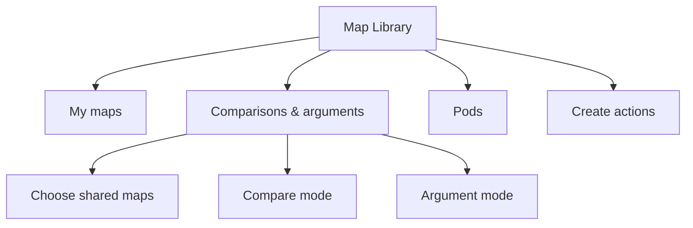

# Harmonious next-work plan

## Current priorities — September 29, 2026 (UTC)

The Dispute form now includes the node's full description below its title, including when editing a dispute. This follow-up is **live in Worker 55**, after all 53 local and hosted checks and public verification. Refresh Harmonious and check long descriptions and narrow screens using [the owner checklist](user-testing-checklist.md). [Deployment status](deployment-status.md) records publication.

## Preceding release — Worker 54

The [four-category Argument update](argument-four-categories-plan.md) is **live in Worker 54**, after all 53 local and 53 hosted checks, the additive database migration and public verification. It offers exactly **Factual basis, Reasoning, Consequences and Feasibility**, with optional explanation/reference, existing responses and preservation of earlier arguments. Next, refresh both PCs and follow **Four-category Argument** in [the owner checklist](user-testing-checklist.md). Argument resolution and the earlier proposed action-label/display redesign remain outside this increment. The technology stack and existing deferrals are unchanged. [Deployment status](deployment-status.md) records publication.

## Preceding release — Worker 53

The **joined agreement card plus simplified overview** is **live in Worker 53**, after all 53 local and 53 hosted checks and public verification. The [implementation plan](agreement-overview-plan.md) records the behavior: mutual agreement, disagreement and asymmetric assessments are recognizable at a distance while both original nodes and stable positions are preserved. Next, refresh both PCs and use the **Joined agreement cards and overview** section of [the owner checklist](user-testing-checklist.md). [Deployment status](deployment-status.md) records source and publication. Existing deferrals remain unchanged.

## Preceding release — Worker 52

The owner's [counterpart controls and assessment changes](counterpart-controls-and-assessments.md) are **live in Worker 52**, after all 53 local and 53 hosted release checks, the additive database migration and public verification. New links use one free counterpart in the same frame; either participant can unlink with attributed history; creation is request-only; personal Agree/Disagree/No position badges and reciprocal Both agree/Both disagree indicators are visible. Blank clicks close transient windows through draft guards. Next, refresh both PCs and continue the owner's [counterpart walkthrough](user-testing-checklist.md). The separate Aligned / In tension proposal and the deferral list remain unchanged.

## Preceding release — Worker 51

The [canvas dragging fix](canvas-panning-fix.md) **shipped in Worker 51**, after all 49 local and 49 hosted checks and public verification. It fixes browser text selection/native dragging cancelling canvas pans across views, with clean gesture interruption and preserved text editing, keyboard/zoom controls and touch pinch. [Deployment status](deployment-status.md) records source `d525242adcc756069c51b1be4ecfa81bece06cbd` and publication. Continue the owner's [updated walkthrough](user-testing-checklist.md); pair-specific **Aligned / In tension** remains the next separate design discussion, and the deferral list is unchanged.

## Preceding release — Worker 50

The owner subsequently requested **full-size ghost counterparts and more canvas space for straight connections**, after reviewing `harmonious 12.png` and `harmonious 13.png`. The [space and connection follow-up](comparison-space-and-lines.md) **shipped in Worker 50**, after all 48 local and 48 hosted checks and public verification. It supersedes Worker 49's compactness preference: full-size ghosts, expanded radial spacing, straight clear parent connections, short adjacent-pair lines and retained zoom on expansion/collapse/filtering. Exceptional obstructed extra connections retain safe routes. [Deployment status](deployment-status.md) records source `7495a711fe92c875fb3e3580405a3ed1b0259fec` and publication. Source/pair semantics and existing deferrals remain unchanged.

## Preceding release — Worker 49

The owner's feedback in `harmonious 10.png` and `harmonious 11.png` was addressed by the [positioning implementation](comparison-positioning-plan.md), **shipped in Worker 49** after all 48 local and 48 hosted checks and public verification. Provisional ordinary-node pairing was removed, compact ghost/status controls were introduced, and comparison spacing followed occupied content. Worker 50 supersedes the compact dimensions and spacing priority. Saved-link compatibility, request and unavailable states, both participants and all shared modes remain covered. [Deployment status](deployment-status.md) records application source `b419d39ab217cda49fdda4f37c9d0c97ed18c95b` and publication. The [diagnosis](comparison-positioning-follow-up.md) retains the preceding findings.

## Preceding release — Worker 48

The [comparison connections and counterpart controls increment](comparison-clarity-plan.md), based on the owner's four annotated screenshots, **shipped in Worker 48**, after all 48 local and 48 hosted checks and public verification. It delivers stable selection, direct counterpart linking from either side, removal of decorative comparison frame lines, and clearer sibling connection routes. [Deployment status](deployment-status.md) records application commit `27269a60d04f5f8f84f59cd1fb445b626978cfaf` and publication.

## Preceding release — Worker 47

The [node-face editing and map-copy follow-up](node-face-editing.md) **shipped in Worker 47**, after all 47 local and 47 hosted checks and public verification. [Deployment status](deployment-status.md) records application commit `d350313ac2d9fe7444a48359899a85ce7637abc0` and publication. Adding a child immediately shows an unsaved preview and focuses its title; Edit opens the node face, with longer context and sources under expandable Details. Confidence offers a slider and exact numeric entry, including an unassessed state. Owned Library cards now expose Copy map, using the existing creation form for a separate private copy. Draft and ownership boundaries remain intact, and the source workflow for copying selected content into an existing map remains separate.

## Preceding release — Worker 46

The [map selection, frame colors, and node-menu cleanup](node-menu-cleanup-plan.md) shipped in **Worker 46**. Comparison source selectors are directly usable; SQ is red, TA blue, and GS green; Edit, Add child node, inspection, and destructive actions are separated; reason creation is an option in the child form; and nullable Confidence has a consistent place on eligible nodes. Child creation stays a draft until explicit submission. The changes retain appropriate differences across Map/Create, source browsing, Inquiry, Compare, and Argument. Application commit `626ad697` is pushed and passed all **46 local and 46 hosted checks** before deployment; public verification passed afterward. [Deployment status](deployment-status.md) records the release.

## Preceding work — September 27, 2026 (UTC)

The [connection drawing plan](connection-drawing-plan.md), informed by `harmonious3.png`, is implemented: truthful collapsed-branch access to real pairs, shared connection routing and on-map Map/Create connection inspection. [Deployment status](deployment-status.md) records publication and verification. The browser-specific investigation is closed. Radial node positions remain; further cross-depth counterpart placement work is deferred by the owner. [The preceding UI follow-up](ui-followup-2026-09-25.md) records the node wording, Inquiry-first ordering and map-editor cleanup.

The consistency increment of the [Compare, Inquiry, and Argument plan](mode-consistency-plan.md) is live: shared interaction summaries and counts, consistent opening and search, and retirement of old authoring routes. The [v4 interaction grammar](interaction-grammar-v4.md) defines the current actions; older reason/challenge, reflection/outcome, and standalone adoption workflows below are historical context, not the current acceptance checklist.

GitHub synchronization and hosted verification are complete: the existing `redesign/node-interactions` history is published, and the manual [Release checks run](https://github.com/tlrdevere/harmonious/actions/runs/36210750517) passed all **46 checks** on exact revision `e42f83ab9fb97b8484bda96fd935ce0481a105e5`. The owner approved a workflow-only addition to remote `main` to register that manual run. Automatic deployment and automatic push/PR checks remain disabled. [Deployment status](deployment-status.md#github-synchronization-and-hosted-verification) records the evidence. Next is the owner's [connection and interaction walkthrough](user-testing-checklist.md) on both accounts and any resulting feedback; the deferred features below are not active work.

The owner's subsequent [code and view-consistency review](code-review-2026-09-27.md) is published as **Worker 45**. Application commit `b3f9a2a` was pushed and passed all **46 local and 46 hosted checks** before deployment; public verification matched the published assets and account gates. The fixes cover source-map connections, interaction editing, confidence attribution/eligibility and deleted-node controls. [Deployment status](deployment-status.md) records the release. The three product suggestions from the preceding discussion are explicitly deferred below.

### Deferred work

- **Cross-depth counterpart placement:** explicitly deferred by the owner. Keep the radial solver and current placement policy; retain the [representative study](design/counterpart-depth-study.html) for a later decision based on concrete visual feedback.
- **Compass design and implementation:** explicitly deferred by the owner, including axis choices, endpoint wording and discovery self-placement. The existing preview remains illustrative; it is not a live feature.
- **Return-visit catch-up:** explicitly deferred by the owner. The proposed “What changed since my last visit?” comparison summary, seen/unread tracking and links to new contributions or changed source wording are not active work.
- **Participant introduction and worked example:** explicitly deferred by the owner. Optional first-session guidance, meaningful-node guidance and a worked exchange using the current interaction modes or an example from the presentation are not active work.
- **Change-context discoverability follow-up:** explicitly deferred by the owner. The proposed review/improvement of how people recover earlier wording and the discussion behind a change is not active work. Existing histories, source snapshots and changed-source warnings remain supported.
- Manual dragging/rearranging, the future pod model, automatic merging of source records, multiple pinned windows, arbitrary reasoning links and richer disagreement-resolution tools remain deferred. The approved [visual agreement grouping](agreement-overview-plan.md) is a separate display change that preserves both source records.
- The [dependency disclosure/advisory review](dependency-review.md) remains a separate deferred maintenance follow-up.

## Earlier priorities — September 22, 2026 (UTC)

The five issues from the [latest review](review-and-next-steps-2026-09-19.md) are fixed. Conversations now group each disagreement point with separately attributed assessments and next steps. Comparisons includes a searchable shared-map browser, ordered by map name. Automated two-account workflows cover the exchange; owner usability acceptance remains the next product check. Compass axis wording remains a product decision.

The core Argument workflow from the [weekly plan](next-week-plan-2026-09-21.md) is implemented: reasons and supporting reasons, separate challenges to statements and reasoning connections, responses, attributed outcomes, references and pinned definitions, all within one shared Comparison. Read [the current workflow](current-argument-workflow.md) and [deployment status](deployment-status.md) for release evidence.

The [next-features plan](next-features-plan.md) is implemented: personal follow-up folds, on-map search and bounded navigation for long chains, recipient-controlled adoption with optional counterpart links and exact definition imports, plus one aggregate verification runner and a manual CI workflow. [Deployment status](deployment-status.md) records the tested and live versions. The [design preview](design/argument-next-features.html) remains an illustrative mockup.

Next:

1. Complete the owner's [two-account walkthrough](user-testing-checklist.md), including points/outcomes as well as folding/search and adoption. Gather concrete issues with readability, target identity, source review and controls before adding categories or more panels.
2. Synchronize the reviewed source to GitHub and run the prepared **Release checks** workflow on that exact revision. The local clean install/verification and hosted CI are distinct; keep automatic deployment disabled. Consider push/PR checks only after the hosted run passes.
3. Refine automatic placement for real conversations if the walkthrough reveals overlapping cards, hard-to-follow chains or excessive panning. Keep the agreed pause on manual dragging.
4. Revisit the [dependency disclosure/advisory follow-up](dependency-review.md) separately before another registry audit.

The current workflow preserves source maps, authorship, exact invoked definitions and contribution history. Acceptance does not automatically resolve a challenge or declare agreement by both people. Older proposal-based graphs remain available through **Earlier reasoning**.

Manual dragging/rearranging, the future pod model, automatic merging, multiple pinned windows and arbitrary reasoning links remain deferred. The original weekly estimates below and in the linked plan are planning history, not a promise that all stretch items have shipped.

## Historical navigation and earlier Argument design

The sections below record earlier design rationale. Shared questions, co-signing and proposals are not prerequisites for the current on-map workflow.

Updated September 10, 2026. The navigation and interaction pass below is now implemented; see [Library release](library-release.md) for delivered behavior, verification and remaining acceptance. The current live version is documented in [deployment status](deployment-status.md). The design rationale below records the transition from automatic map opening and separate Compare/Argument destinations to the Library and shared mode switch.

## What remains from the previous request

The initial Argument release is live, but the final acceptance work still needs the owner's hands-on walkthrough:

- Sign into two separate browser profiles or two PCs.
- Confirm that each account sees the same overall Comparison for a shared map pair.
- Add a Ground and Evidence from one account, then a Value and Rebuttal from the other.
- Switch between Compare and Argument, reopen the same proposal, and confirm authorship and history.
- Edit a reason that another person connected to; confirm the connection becomes **Needs review** and can be reviewed by its author.
- Reload only after the page reports that changes are saved.
- Judge whether the automatic reasoning layout, labels, arrows, and proposal-version language are understandable.

The Library release includes the Argument follow-up fixes: preserving the camera/frame, preventing a second form from discarding the first form's draft, and preventing background worldview clicks from silently choosing Argument endpoints. Application, account and two-session browser checks cover these behaviors.

The two-account browser walkthrough now passes against an isolated test store with the actual account projection and authorization policy. The owner's live walkthrough remains a product acceptance check.

The reusable checklist is [user-testing-checklist.md](user-testing-checklist.md). Do not use sign-in codes or private keys as test data, and download a backup before creating disposable test maps.

## Recommended information architecture

Make **Map Library** the authenticated landing area and the place where a person finds or starts work. It is a home for the objects that currently sit across several tabs:



The main navigation should become:

| Main destination | Purpose | First screen |
| --- | --- | --- |
| **Map Library** | Find maps, comparisons, arguments and pods; create new work | Library cards and empty states |
| **Maps** | Edit a selected map | Map chooser or “Choose a map” empty state |
| **Compare & align** | Work on one map pair and one proposal | Compare mode, with Argument as a sibling mode |
| **Pods** | Inspect a pod or begin pod setup | Pod list or design state |

The account menu can contain backup, import, sign out and display-name settings. It should not compete with the work destinations.

### Library landing behavior

After sign-in, open **Map Library**, not the first map. A person must choose a map before the radial editor is shown. If there are no maps, show a clear **Create your first map** action and a short explanation of private versus shared visibility. If there are maps but none is selected, Maps shows a chooser rather than an arbitrary map.

The chooser should remember the last selected map for convenience only after the person has explicitly selected it. A direct link to a map, comparison, proposal or Argument still opens that specific object. A failed or unavailable link should return to Library with a useful message.

Library sections should show:

- **My maps**: private and shared maps owned by the signed-in person, with map type, last updated time and visibility.
- **Comparisons & arguments**: overall map pairs, latest proposal status, current agreement/review state, and whether an Argument has contributions.
- **Pods**: existing derived pods, with an explicit “derived from” label until the authored-versus-derived design is decided.

Shared maps should be available from the **Comparisons & arguments** area when choosing the two source maps, and from comparison detail when revisiting a pair. They do not need a top-level tab of their own. Recent shared sources can be surfaced as contextual cards in Map Library without becoming a separate destination.

New work belongs here as actions. **Create map** opens the map form. **Create comparison** opens a source picker for two accessible maps, then creates or opens their one overall Comparison. Argument is opened from a selected proposal, so it cannot lose its Compare context.

## Compare and Argument as one thing

Use **Compare & align** as the shared destination and put a compact mode switch directly below its context header:

```text
Compare & align       [ Map A  /  Map B ]   [Proposal 2 · Needs review]

                 [ Compare ]   [ Argument ]
```

Both modes should retain the same map pair, selected proposal, proposal version, source identities, camera position and relevant expanded branches. The header should always show:

- the two map names and owners;
- the selected proposal question and version;
- the current state: pending, agreed, differing, source review, or needs clarification;
- a link back to the Map Library.

In **Compare**, the overlaid maps remain the main canvas. Selecting two source nodes proposes a correspondence; the side panel records the question, answer relationship and clarification.

In **Argument**, the same source positions stay anchored in the canvas. Grounds, Evidence and Values appear as reasoning cards below or beside them, with directional Supports, Evidence for and Rebuts connections. The inspector changes to reasoning controls, while the shared context header remains unchanged.

The mode switch is a view change, not a new object. A person should not have to “open Argument” through a second top-level navigation route after choosing a proposal. Deep links can still include `view=argument` and a proposal version.

An empty Comparison has Compare selected and explains **Choose source nodes to propose a correspondence**. An empty Argument has Argument selected and explains **Select a recorded proposal before adding reasoning**. This avoids a blank canvas with no context.

## Cleaning up Explore & co-sign remnants

The current implementation has several names and pathways that should be consolidated:

| Current remnant | What it does now | Recommended destination |
| --- | --- | --- |
| `discover-mode` labeled **Explore & co-sign** | Acts as map catalog and contribution browser | Map Library |
| `discover-workspace` and `participation-ui.mjs` | Map search, source detail, co-sign/copy actions, contribution history | Library map detail and a **My contributions** filter |
| `explore-current` / `exploreNode()` | Leaves the current map and opens its source in Explore | Replace with **View in Library** or keep map detail in-place |
| `reference-stage` and “Maps to explore” | Displays a selected map for browsing | Library's selected-map detail |
| “Co-sign map”, “Co-sign section”, “Copy & adapt” | Valid contribution actions | Keep, but expose from a selected shared map or source node in Library and Compare |
| `acting-participant` / “Recording for” | Facilitator-era participant selector | Remove from account mode; retain only in the portable facilitator demo if still needed |
| “Pods from shared nodes” | Existing derived pod prototype | Keep as Pods, with its derived status visible |
| Historical docs and `review/Harmonious-cosign-prototype.html` | Records the earlier prototype | Keep as history; do not present it as the current product |

The cleanup should be staged. First rename visible labels and move the entry point. Then move the map detail and co-sign flows behind Library cards. Only after the new path is tested should the old discover IDs and `exploreNode()` adapter be removed. This avoids breaking saved links and the portable demo in one pass.

Co-signing is still useful. It should become a contribution action attached to a shared map/node, while comparisons and arguments remain the place for bilateral reasoning. A co-sign should not be a hidden prerequisite for seeing a map, creating a Comparison, or adding an Argument.

## Actions on the map itself

The plus affordance is a good fit for the most common action: adding a child. It should be a real button in the node footer, not a hover-only decoration:

```text
┌────────────────────────────┐
│ A node title               │
│ Short description          │
│ Position          [ + ]    │
└────────────────────────────┘
```

Clicking **+** opens the existing child form with the selected node already set as the parent. The button's accessible name should be **Add a child to “…”**. The node card itself continues to select the node for reading and editing; the footer action must stop propagation so it does not also open the inspector.

For the selected node, show a small adjacent action menu on desktop and an inline action row on narrow screens. Keep it short:

- **Edit wording**;
- **Add child**;
- **Connect existing node**;
- **Compare this position**;
- **Add to Argument** when a current proposal is open;
- **More** for delete and source-specific actions.

The menu is a convenience layer over existing panel controls. The inspector remains the full form and the reliable keyboard path. Every action must have a button or menu equivalent for keyboard, touch and screen readers. Other people's map cards should show Compare/co-sign/read actions, but not edit or delete.

Do not put every action permanently on every card. A visible plus for the common child action, selection state for the current node, and a compact menu for less frequent actions will keep the map readable. In Compare, source cards should offer selection and Compare/Argument context; map-edit actions belong to the owner's Maps view.

## Implementation sequence

1. **Acceptance and release hygiene** — complete the two-account walkthrough, include the current local Argument fixes in the next release, and keep the backup/reload guidance visible.
2. **Map Library shell** — add the landing view, object lists, empty states and create actions. No database migration is required if it reads the existing projected workspace.
3. **No automatic map** — make startup and Maps use an explicit selection state. Preserve direct-link opening and portable file behavior.
4. **Combine navigation** — replace separate Compare and Argument top-level buttons with Compare & align plus the Compare/Argument mode switch. Preserve the current direct route parameters for compatibility.
5. **Move contribution browsing** — relocate the current participation catalog and history into Library map detail; rename visible Explore labels; keep co-sign and copy semantics unchanged.
6. **Inline node actions** — add the footer plus button and selected-node menu, with keyboard and touch behavior covered by UI tests.
7. **Pods presentation** — place Pods in Library and keep the current derived prototype clearly labeled while the authored-versus-derived decision remains open.

Later work can add argument outcomes, richer elicitation, reversible display of agreed source nodes, graph layout improvements and pod authoring. Those should follow a round of user testing on this simpler structure.

## Code review findings

The current model and account boundary are sound for this pass: Argument nodes and edges are separate owned records, source maps are preserved, proposal versions are pinned, and application/account/PostgreSQL tests pass. The cleanup items are mainly navigation and state management:

- **High**: `WorkspaceController` initializes `activeMapId` to `workspace.maps[0]` and calls `loadMap()` during startup. This is the behavior that makes a map appear before selection. Replace it with an explicit `selectedMapId`/empty state.
- **High**: Compare and Argument are separate top-level controls even though Argument depends on a proposal. Combine their navigation while keeping separate mode state and routes.
- **Medium**: The legacy participation/catalog structure, map-library handoff, and facilitator “Recording for” surfaces still make parts of the account product read like the historical facilitator prototype. Move or relabel them as described above.
- **Medium**: `participation-ui.mjs` is now both a library and a contribution workflow. Splitting catalog/map-detail rendering from co-sign mutation logic will make the Map Library change safer.
- **Medium**: `account-ui.mjs` currently intercepts selection of another owner's map and sends it to `exploreNode()`/the discover surface. The Library should make shared-map access an explicit detail state instead of routing around the Maps editor.
- **Medium**: `WorkspaceController` owns map editing, comparison routing, library transition hooks and mode switching. Extracting a small library controller and a Compare & align controller will reduce cross-mode state bugs.
- **Low**: Keep legacy IDs such as `discover-workspace` and `exploreNode()` only through a temporary adapter while links and the portable demo are migrated. Remove them after route and export tests pass.
- **Low**: The local Argument follow-up fixes are not in the deployed Worker yet. Do not call the release fully accepted until those fixes and the visual walkthrough are complete.

## Decisions to keep explicit

- Map Library is the landing/home container; Maps is an editor reached after selecting a map.
- Compare & align is one destination with Compare and Argument modes.
- Co-signing remains a deliberate contribution action, but its browsing entry point moves into Library.
- Pods stay visible but are labeled as derived until the authored-versus-derived product decision is made.
- Agreement display may eventually offer a reversible merged card; it should not destructively merge either person's source node.
